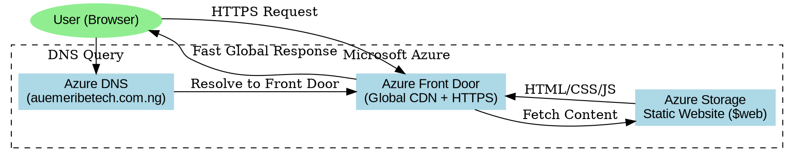

DAY 1 = # Production-Ready Static Website Hosting on Azure
DAY 1 = # Production-Ready Static Website Hosting on Azure
## Azure CLI + Azure Front Door + Azure DNS + HTTPS

---

# Project Overview

This project demonstrates how to deploy a production-ready static website on Microsoft Azure using:

- Azure Storage Static Website Hosting
- Azure Front Door (Global CDN)
- Azure DNS
- HTTPS with Managed SSL
- Azure CLI

The architecture is:

- Serverless
- Globally distributed
- Secure
- Cost-effective
- Production-ready

---

# Real-World Scenario

You just got hired as a Junior Cloud Engineer at a fast-growing startup called **Your Techie Hub**.

The business team requests:

> “We need a landing page live ASAP — fast, secure, globally accessible, and no servers.”

Requirements:

- Fast global delivery
- HTTPS enabled
- Custom domain
- Low-cost hosting
- Zero server management

Your mission:
Build a fully production-ready static website architecture using Azure CLI.

---

# Project Objectives

You will deploy a static website using:

- Azure Storage Account
- Azure Front Door
- Azure DNS
- Managed HTTPS
- Custom Domain
- Azure CLI Automation

---

# Architecture Overview

```text
Developer
    ↓
Azure Storage Static Website
    ↓
Azure Front Door
    ↓
Azure DNS
    ↓
www.auemeribetech.com.ng
    ↓
End Users
```
---

# Technologies Used

- Azure Storage Account
- Azure Front Door
- Azure DNS
- Azure CLI
- Graphviz
- HTML/CSS/JavaScript

---

# Prerequisites

Before starting, ensure you have:

- Azure Account
- Azure CLI Installed
- Domain Name
- Static Website Files
- Graphviz Installed


---

# Project Structure


---


# Prerequisites

1. Before starting, ensure you have:

- Azure Account
- Azure CLI Installed
- Domain Name
- Static Website Files
- Graphviz Installed

2. Verify Azure CLI:

```bash
az --version
```

Upgrade Azure CLI:

```bash
az upgrade
```

Login to Azure:

```bash
az login
```


# PHASE 0 — CREATE ARCHITECTURE DIAGRAM

# Generate Architecture Diagram

## Step 1 - Install Graphviz locally using Homebrew:

```bash
/bin/bash -c "$(curl -fsSL https://raw.githubusercontent.com/Homebrew/install/HEAD/install.sh)"

brew install graphviz
```


## Step 2 - Verify installation

```bash
dot -V
```


## Step 3 - Create diagram source

```bash
nano docs/architecture-diagram.dot
```

Paste:




## Step 4 - Generate PNG:
```bash
dot -Tpng architecture-diagram.dot -o architecture-diagram.png
```

## Step 5 - Generate SVG:

```bash
dot -Tsvg architecture-diagram.dot -o architecture-diagram.svg
```


# PHASE 1 — CREATE RESOURCE GROUP

Everything in Azure should exist inside a Resource Group.

```bash
az group create --name techiehub-rg --location westus3
```

---

# PHASE 2 — CREATE STORAGE ACCOUNT

Storage account names must be globally unique.

```bash
az storage account create --name techiehubsite12345 --resource-group techiehub-rg --location westus3 --sku Standard_LRS --kind StorageV2
```

---

# PHASE 3 — ENABLE STATIC WEBSITE HOSTING

```bash
az storage blob service-properties update --account-name techiehubsite12345 --static-website --index-document index.html --404-document 404.html
```

---

# PHASE 4 — UPLOAD WEBSITE FILES

1. Get Storage Key:

```bash
az storage account keys list --account-name techiehubsite12345 --resource-group techiehub-rg --query "[0].value" -o tsv
```


2. Upload files:

```bash
az storage blob upload-batch --account-name techiehubsite12345 --destination '$web' --source . --auth-mode login
```

---

# Troubleshooting Upload Permission Errors

If upload fails due to permissions:

---

## PHASE 5 — GET USER OBJECT ID

```bash
az ad signed-in-user show --query id -o tsv
```

Example:

```text
df091365-4fa4-4361-8cf3-454c78f02bcf
```

---

## PHASE 6 — ASSIGN STORAGE ROLE

```bash
az role assignment create --assignee <OBJECT_ID> --role "Storage Blob Data Contributor" \
  --scope /subscriptions/<SUB_ID>/resourceGroups/techiehub-rg/providers/Microsoft.Storage/storageAccounts/techiehubsite12345
```

Example:

```bash
az role assignment create --assignee df091365-4fa4-4361-8cf3-454c78f02bcf --role "Storage Blob Data Contributor" --scope /subscriptions/ecca4df5-3dc5-42c3-b0a4-c704f3e13b1b/resourceGroups/techiehub-rg/providers/Microsoft.Storage/storageAccounts/techiehubsite12345
```

---

# PHASE 7 — WAIT FOR RBAC PROPAGATION

Wait approximately:

```text
1 minute
```

---

# PHASE 8 — RETRY FILE UPLOAD

```bash
az storage blob upload-batch --account-name techiehubsite12345 --destination '$web' --source . --auth-mode login
```

---


# TEST STATIC WEBSITE

1. Get website endpoint:

```bash
az storage account show --name techiehubsite12345 --query "primaryEndpoints.web" --output tsv
```


Example:

```text
https://techiehubsite12345.z1.web.core.windows.net
```

2. Open in browser.

---

# PHASE 9 — CREATE AZURE FRONT DOOR

```bash
az afd profile create --resource-group techiehub-rg --profile-name techiehub-afd --sku Standard_AzureFrontDoor
```

---

# PHASE 10 — CREATE FRONT DOOR ENDPOINT

```bash
az afd endpoint create --resource-group techiehub-rg --profile-name techiehub-afd --endpoint-name techiehub-endpoint
```

---

# PHASE 11 — CREATE ORIGIN GROUP

```bash
az afd origin-group create --resource-group techiehub-rg --profile-name techiehub-afd --origin-group-name techiehub-origin-group --sample-size 4 --successful-samples-required 3
```

---


# PHASE 12 — ADD STORAGE ORIGIN

```bash
az afd origin create --resource-group techiehub-rg --profile-name techiehub-afd --origin-group-name techiehub-origin-group --origin-name storage-origin --host-name techiehubsite12345.z1.web.core.windows.net --origin-host-header techiehubsite12345.z1.web.core.windows.net
```

---

# PHASE 13 — CREATE ROUTE

```bash
az afd route create --resource-group techiehub-rg --profile-name techiehub-afd --endpoint-name techiehub-endpoint --route-name default-route --origin-group techiehub-origin-group --supported-protocols Http Https --forwarding-protocol MatchRequest --link-to-default-domain Enabled
```

---

# TEST FRONT DOOR

Get endpoint:

```bash
az afd endpoint show --resource-group techiehub-rg --profile-name techiehub-afd --endpoint-name techiehub-endpoint --query "hostName" -o tsv
```

Example:

```text
techiehub-endpoint.z01.azurefd.net
```


Wait:
- 10–30 minutes

Then test in browser.


---

# PHASE 14 — CREATE CUSTOM DOMAIN

```bash
az afd custom-domain create --resource-group techiehub-rg --profile-name techiehub-afd --custom-domain-name auemeribetech-domain --host-name www.auemeribetech.com.ng --certificate-type ManagedCertificate --minimum-tls-version TLS12
```

---

# PHASE 15 — VALIDATION STATE

Azure creates domain with:

```text
validationState: Pending
```

---

# PHASE 16 — GET DNS VALIDATION RECORDS

```bash
az afd custom-domain show --resource-group techiehub-rg --profile-name techiehub-afd --custom-domain-name auemeribetech-domain
```

Look for:

TXT Record:

```text
_dnsauth.www.auemeribetech.com.ng
```


CNAME:

```text
www.auemeribetech.com.ng
```

---

# PHASE 17 — CREATE AZURE DNS ZONE

```bash
az network dns zone create --resource-group techiehub-rg --name auemeribetech.com.ng
```

---

# PHASE 18 — GET AZURE NAMESERVERS

```bash
az network dns zone show --resource-group techiehub-rg --name auemeribetech.com.ng --query nameServers -o tsv
```

Example:

```text
ns1-08.azure-dns.com
ns2-08.azure-dns.net
ns3-08.azure-dns.org
ns4-08.azure-dns.info
```

---

# PHASE 19 — UPDATE DOMAIN REGISTRAR

1. Go to:
- QServers
- Namecheap
- GoDaddy

2. Replace existing nameservers with Azure nameservers.


3. Wait:
- 5–30 minutes

4. Verify:

```bash
dig auemeribetech.com.ng NS
```

---

# PHASE 20 — CREATE CNAME RECORD

```bash
az network dns record-set cname create --resource-group techiehub-rg --zone-name auemeribetech.com.ng --name www
```

Set record:

```bash
az network dns record-set cname set-record --resource-group techiehub-rg --zone-name auemeribetech.com.ng --record-set-name www --cname techiehub-endpoint-ctgnhpeverechye7.z03.azurefd.net
```

---

# PHASE 21 — CREATE TXT RECORD

```bash
az network dns record-set txt create --resource-group techiehub-rg --zone-name auemeribetech.com.ng --name _dnsauth.www
```

Add token:

```bash
az network dns record-set txt add-record --resource-group techiehub-rg --zone-name auemeribetech.com.ng --record-set-name _dnsauth.www --value "_uomepz8gii9gtsfwjh1ceqenumsxbbz"
```

---

# PHASE 22 — WAIT FOR DNS PROPAGATION

1. Wait:
- 5–15 minutes

2. DNS needs a moment to propagate records.

3. While waiting, proceed to the following phase:
---

# PHASE 23 — VERIFY TXT RECORD

```bash
nslookup -type=TXT _dnsauth.www.auemeribetech.com.ng
```

Expected:

```text
"_uomepz8gii9gtsfwjh1ceqenumsxbbz"
```

---

# PHASE 24 — VERIFY CNAME

```bash
nslookup www.auemeribetech.com.ng
```

Expected:

```text
techiehub-endpoint-ctgnhpeverechye7.z03.azurefd.net
```

---

# PHASE 25 — VALIDATE DOMAIN

```bash
az afd custom-domain show --resource-group techiehub-rg --profile-name techiehub-afd --custom-domain-name auemeribetech-domain --query validationState
```

Expected:

```text
Approved
```
Alternatively run:
```bash
az afd custom-domain show --resource-group techiehub-rg --profile-name techiehub-afd --custom-domain-name auemeribetech-domain
```


---

# PHASE 26 — ATTACH DOMAIN TO ROUTE

```bash
az afd route update --resource-group techiehub-rg --profile-name techiehub-afd --endpoint-name techiehub-endpoint --route-name default-route --custom-domains auemeribetech-domain
```

---

# PHASE 27 — VERIFY HTTPS

```bash
az afd custom-domain show --resource-group techiehub-rg --profile-name techiehub-afd --custom-domain-name auemeribetech-domain --query tlsSettings
```

Expected:

```text
"certificateType": "ManagedCertificate"
```

---

# FINAL TEST

Visit:

```text
https://www.auemeribetech.com.ng
```

Verify:
- HTTPS enabled
- Front Door active
- Global CDN working
- Static website loads


---

# Common Errors and Fixes

## Page Not Found

Fix:
- wait for propagation
- verify Front Door route
- ensure static endpoint used

---

## Domain Not Working

Fix:
- verify CNAME
- attach domain to route
- verify DNS propagation

---

## Root Domain Issues

Fix:
- use `www`
- root domains require ALIAS/ANAME

---

# Cleanup Resources

1. Delete resource group by running:
```bash
az group delete --name techiehub-rg --yes --no-wait
```


2. Verify the cleanup is executed successfully by checking the existence of the resource group using:
```bash
az group show --name techiehub-rg
```


---

# GitHub Repo Update

1. Run the following to Update your github repo within the project direction
```bash
git init
git add .
git commit -m "Azure Static Site Frontdoor DNS Project Completion"
git branch -M main
gh repo create azure-static-site-frontdoor-dns --public --source=. --remote=origin --push
```


# Key DevOps Lessons

- Serverless reduces operational costs
- Front Door improves global performance
- DNS is critical in production systems
- HTTPS is mandatory
- Azure CLI enables repeatable automation

---

# Final Outcome

- Production-ready architecture
- Global CDN delivery
- Managed HTTPS
- Azure DNS integration
- Fully automated infrastructure
- Serverless static website hosting

---

# Final Thought

> “Real cloud engineering isn’t about clicking buttons — it’s about building systems that can be recreated from scratch.”

---

# Author

Anthony Uchenna Emeribe

Cloud / DevOps Engineer
